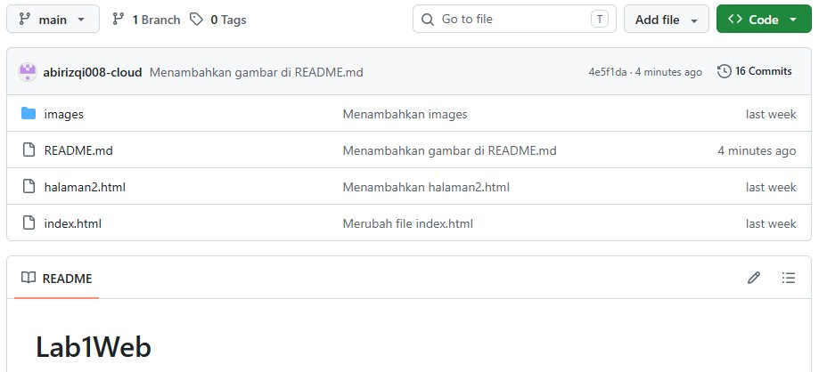

# Lab1Web

## Praktikum 1 HTML Dasar

## Identitas
- **Nama** : Muhammad Agusti Abi Rizqi
- **NIM** : 312510042
- **Kelas** : I253A 
- **Prodi / Semester** : Teknik Informatika / 3

## Tujuan
1. Mahasiswa mampu memahami struktur dasar HTML.
2. Mahasiswa mampu memahami tag-tag dasar HTML.
3. Mahasiswa mampu membuat dokumen HTML.

## Langkah-langkah Praktikum
1. Membuat Repository
    
Membuat repository di GitHub dengan nama Lab1Web

    

2. Membuat Paragraf

    - **Tag '
'(Paragraf)**: Tag ini digunakan untuk mengelompokkan dan menampilkan blok teks baru dalam halaman web. Setiap elemen '
' secara otomatis akan membuat baris baru dengan jarak (spasi atas dan bawah) dari elemen di sekitarnya.

    - **Komentar HTML (<!-- ... -->)**: Teks yang berada di dalam tanda ini berfungsi sebagai catatan atau dokumentasi di dalam kode. Komentar tidak akan ditampilkan di dalam browser saat halaman web dibuka, melainkan hanya bisa dilihat oleh pembuat kode (developer).